# Ros-project
- 3학년 2학기 로봇프로그래밍 팀프로젝트
- 프로그램 진행간 진행했던 문서의 일부만을 보여줍니다.

## Contributor
- inhwan Jeong 정인환(ghjklla007@naver.com)
- Byeonggil Lee 이병길
- Sichang Choi 최시창
- Cheolho Choi 최철호

## 프로젝트 계획
- 프로젝트 비전  
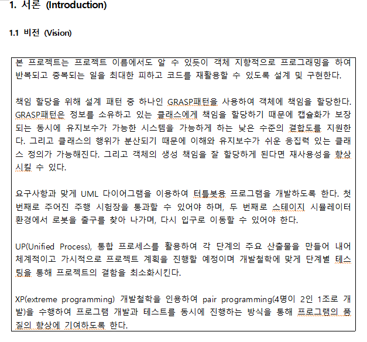

- 유스케이스 다이어그램  

- 시스템 인터페이스  
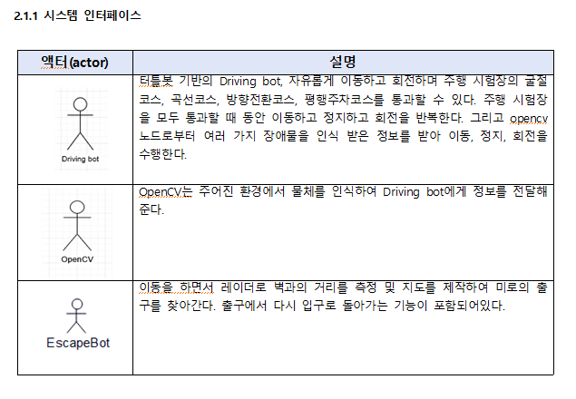

- 사용자 인터페이스  
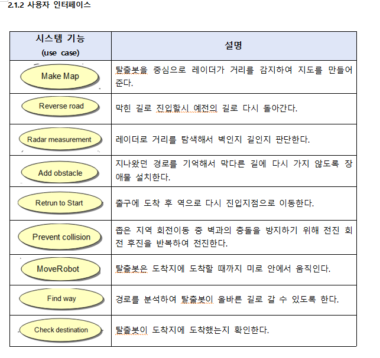

- 통신 인터페이스  
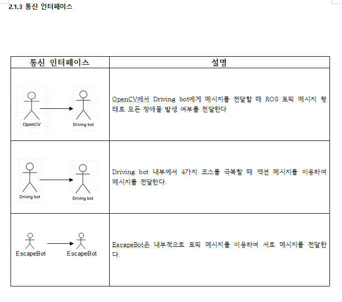

- 고수준 유스케이스  
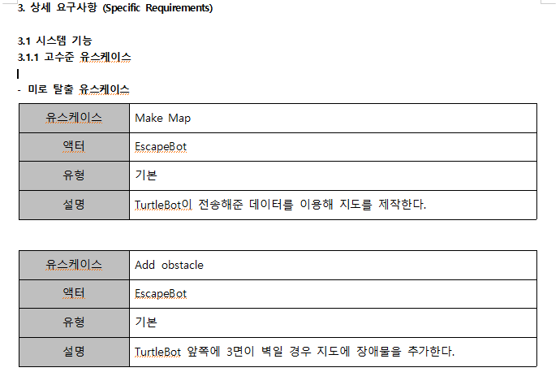

- 확장 유스케이스  
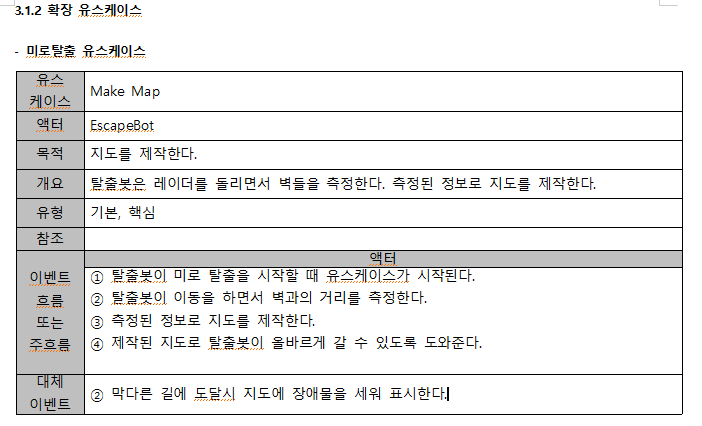

- 프로젝트 계획(엑셀파일을 이용하여 제작)  
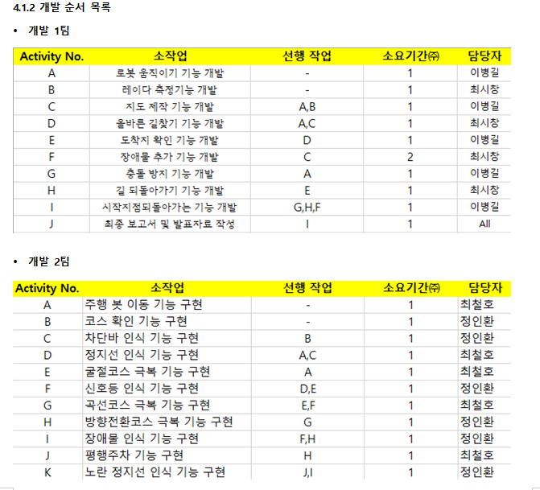

- 프로젝트 소요시간 산출 -CPM 기법 이용  
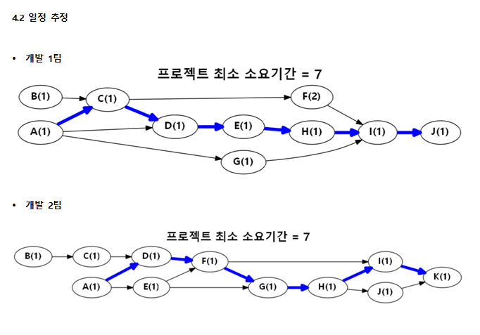

 
 

## 프로젝트 결과

- 프로젝트 비전  
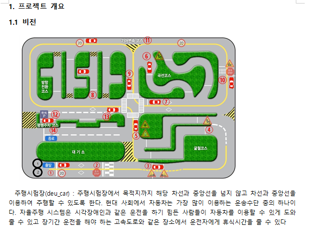

- 프로젝트 문제 기술  
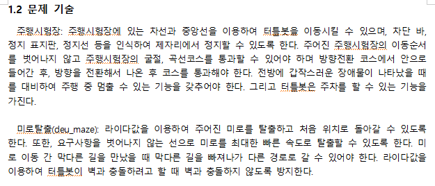

- 고객 요구사항  
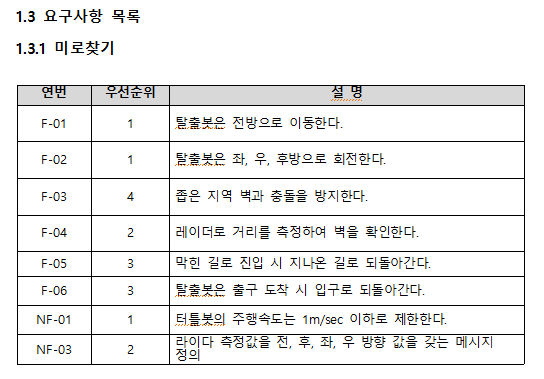

- 관련 기술  
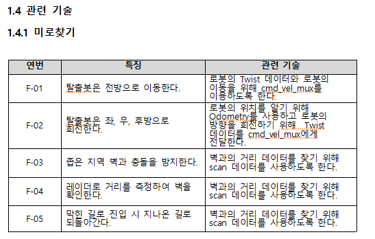

- 확장 유스케이스  
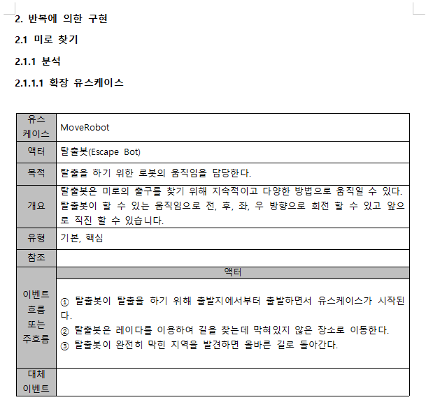

- 시스템 순차 다이어그램  
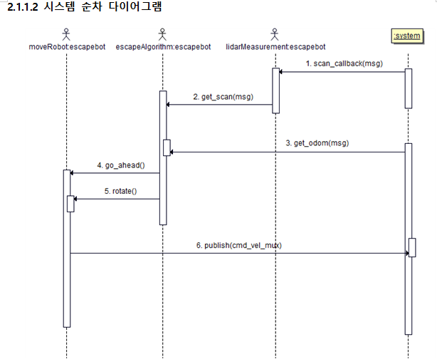

- 도메인 모델  
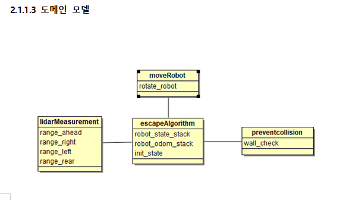

- 시스템 오퍼레이션  
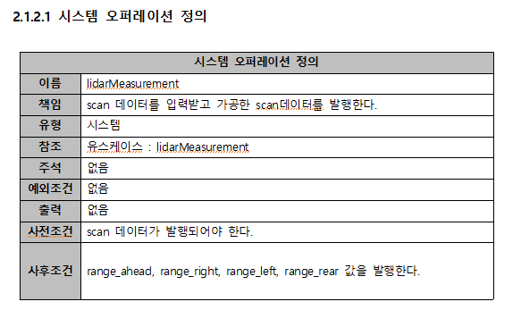

- 통신 다이어그램  
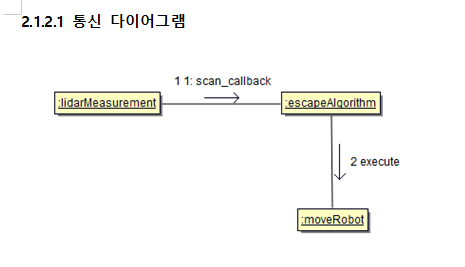

- 설계단계 클래스 다이어그램  
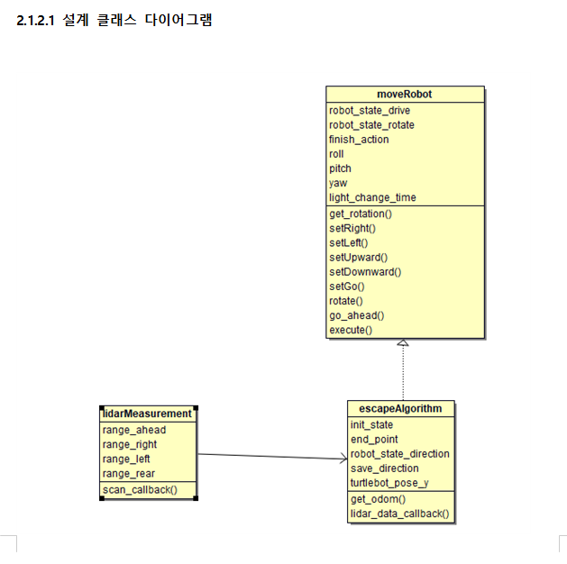

- 구현  
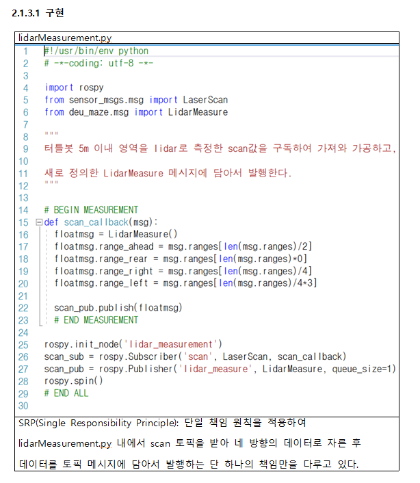

- 프로젝트 결과  
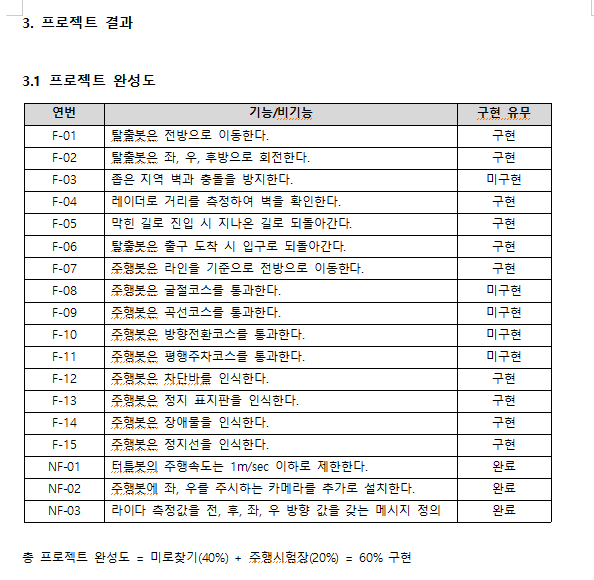

 
 

## 시연 사진
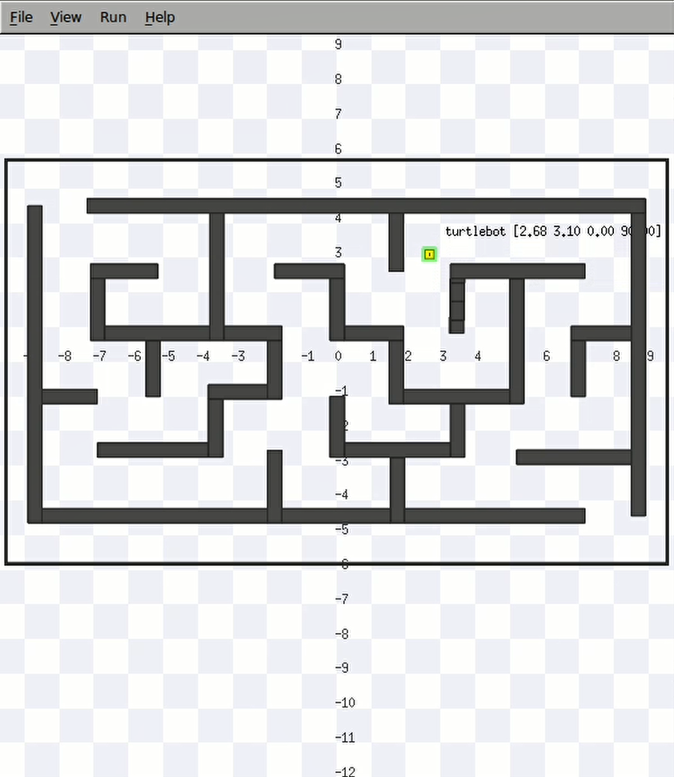
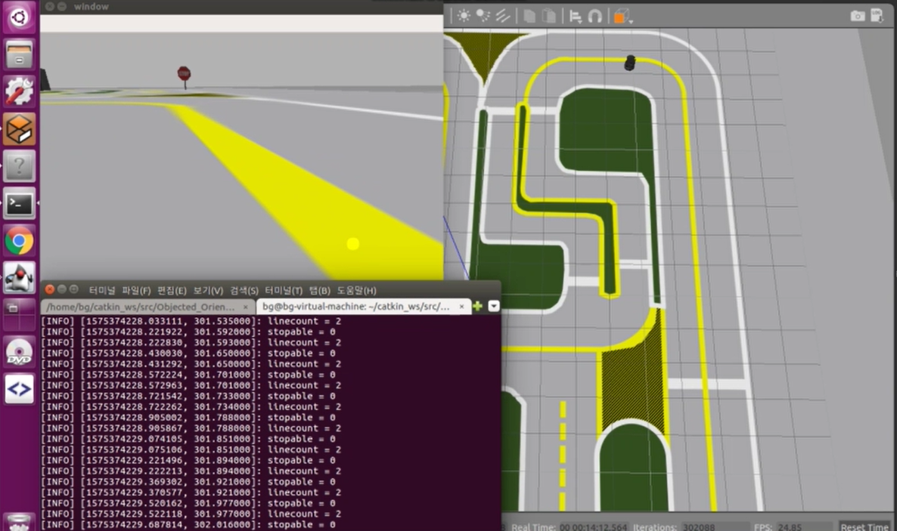
