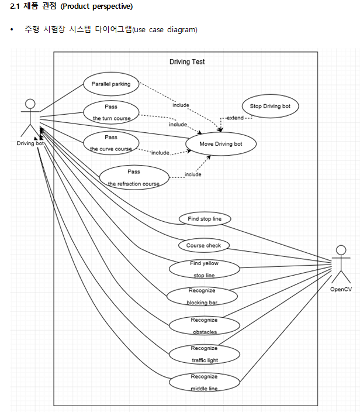

# Ros-project
3학년 2학기 로봇프로그래밍 팀프로젝트

## Contributor
- inhwan Jeong 정인환(ghjklla007@naver.com)
- Byeonggil Lee 이병길
- Sichang Choi 최시창
- Cheolho Choi 최철호

## 프로젝트 계획
- 프로젝트 비전

- 유스케이스 다이어그램입니다.

- 시스템 인터페이스입니다.

- 사용자 인터페이스입니다.

- 통신 인터페이스입니다.

- 고수준 유스케이스입니다.

- 확장 유스케이스입니다.

- 프로젝트 계획입니다.(엑셀파일을 이용하여 제작)

- 프로젝트 소요시간 산출 -CPM 기법 이용

 
 

## 프로젝트 결과

 
 

## 시연 사진

